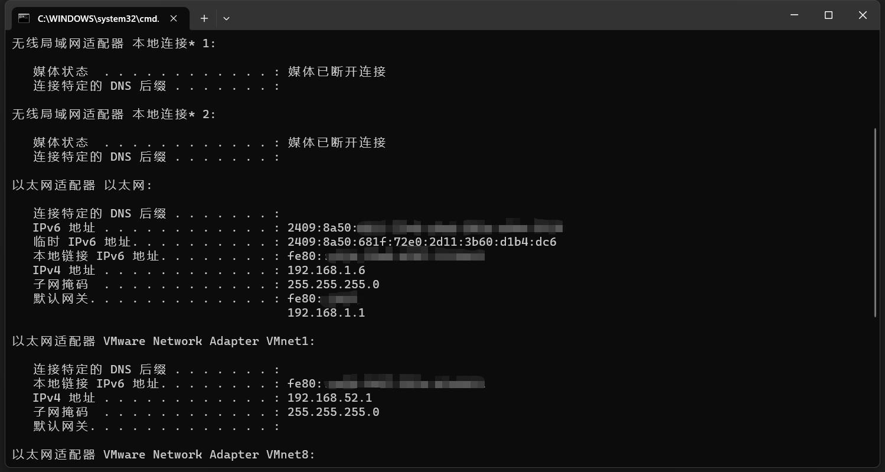

# Remote_SD

利用微信远程启动 `Stable Diffusion`。

##### 依赖于 `uiautomation `：

```python-repl
pip install uiautomation
```

##### 使用前先修改一些路径和参数：

1. `launch_huishi.bat` 中绘世启动器的路径地址和名称
2. `webui_ipv4.bat` 和 `webui_ipv6.bat` 中的启动参数和路径地址及名称
3. `get_ipv6.py` 中 `getIPv6Address` 的 `position` 表示使用哪个IP地址，如下图所示：（默认使用的是临时 IPv6 地址）



设置修改好后运行命令 `python .\code\wechat.py`

脚本运行时会尝试登录微信，找到 文件管理助手，发送 IPv6 地址然后循环处理 文件管理助手 的最后一条信息。所以使用时务必将 文件管理助手 置顶。

##### 目前可执行的命令：

* @启动：以普通模式启动 Stable Diffusion
* @启动6：以 IPv6 模式启动 Stable Diffusion
* @关闭：停止 Stable Diffusion
* @启动绘世：以普通模式启动 绘世
* @启动绘世6：以 IPv6 模式启动 绘世
* @关闭绘世：停止 绘世
